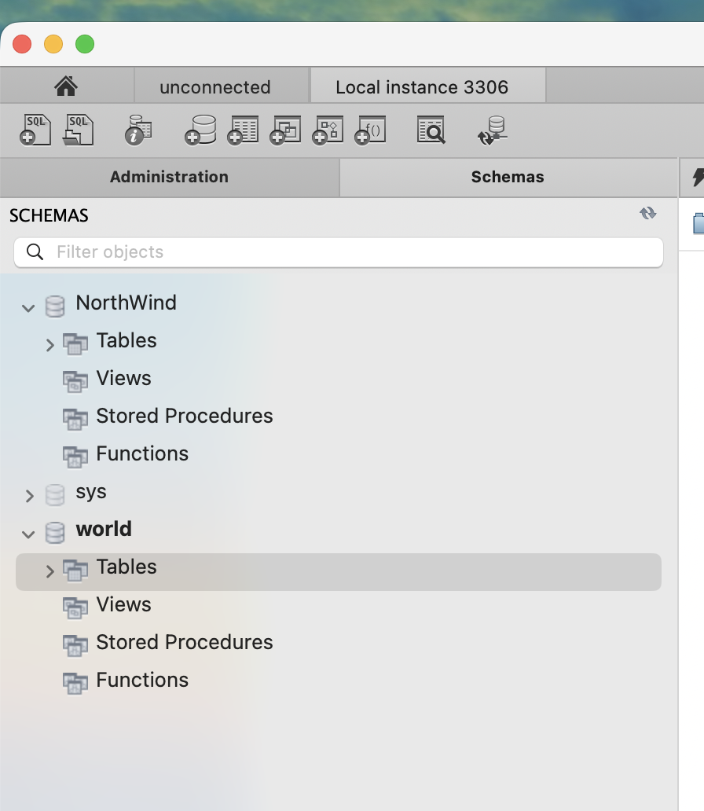
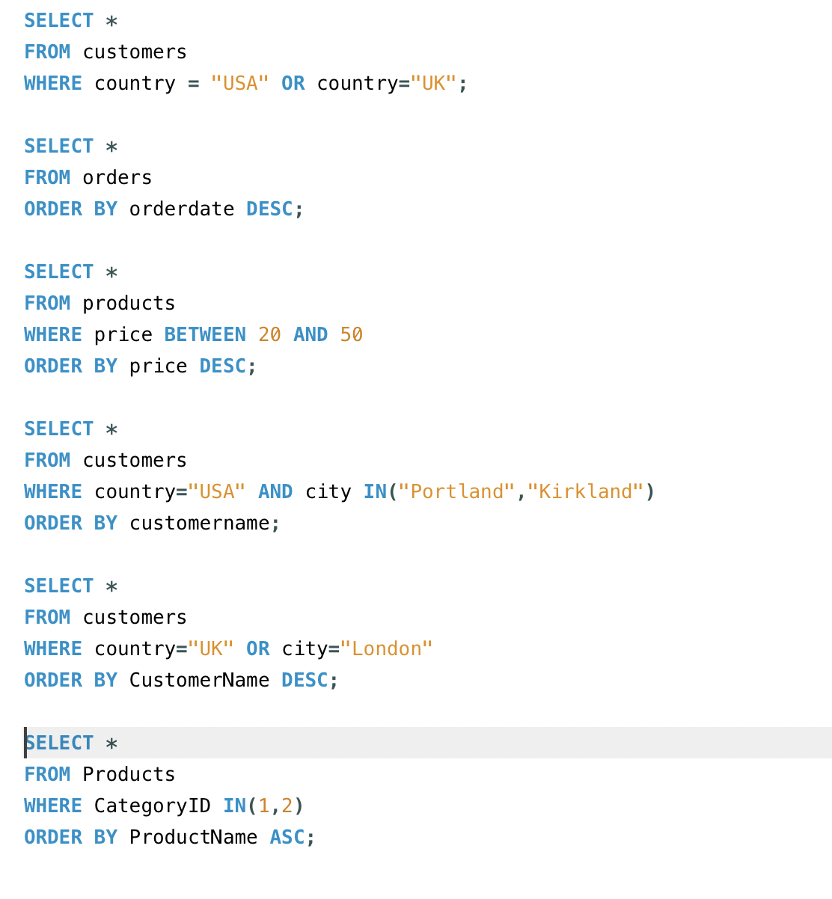
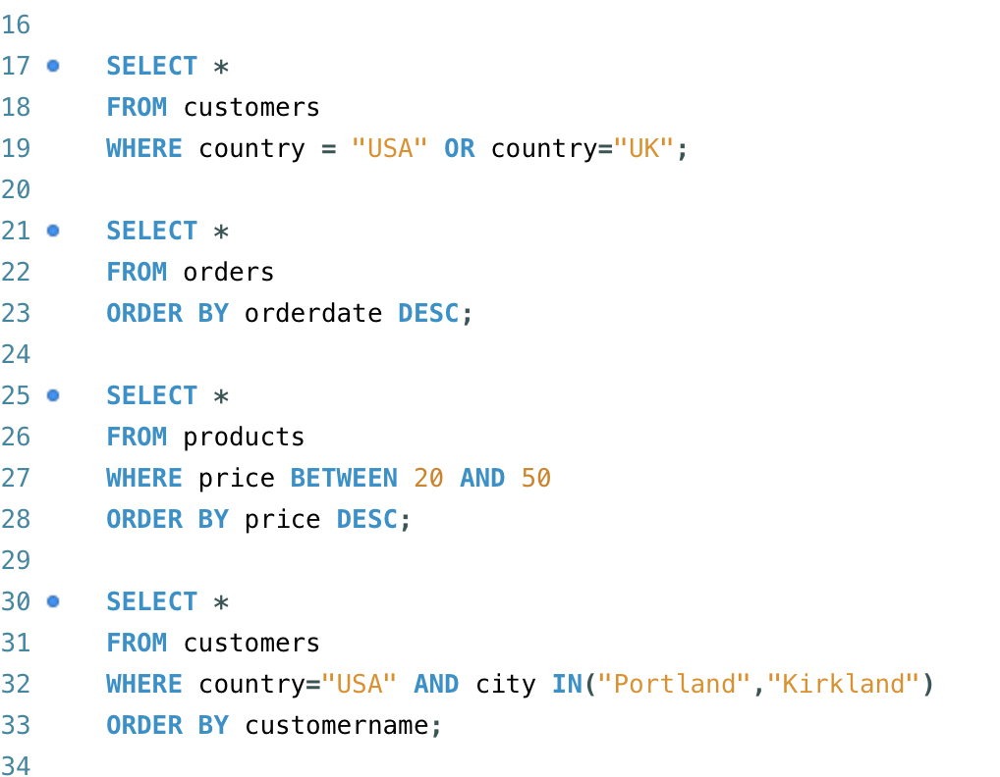
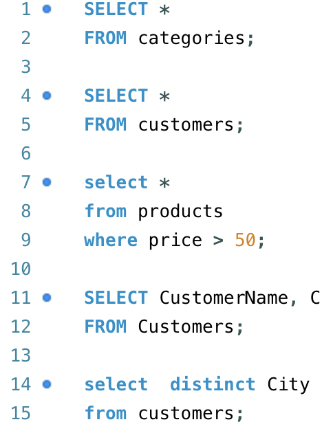
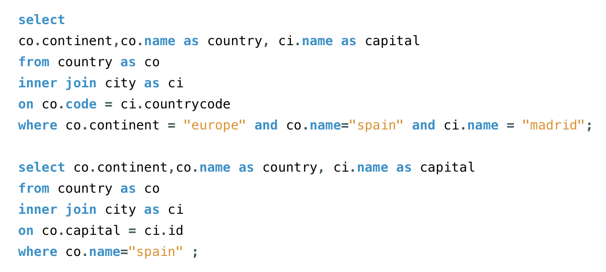
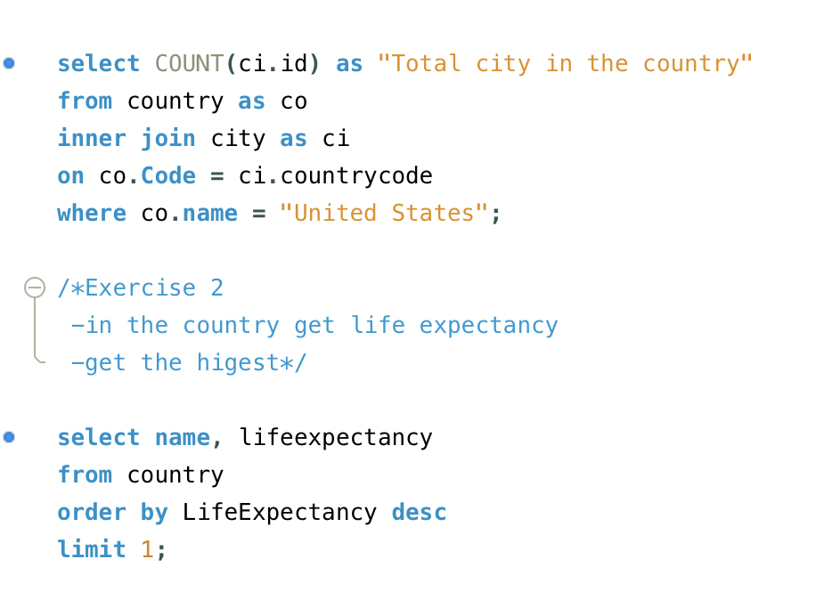

# 🗃️ SQL Practice – MySQL Workbench Exercises

This repository contains my practical SQL exercises completed using **MySQL Workbench**.  
The goal of this project is to build a strong foundation in SQL by practicing real queries on well-known sample databases.

---

## 🛠️ Setup

1. I downloaded and installed **MySQL Workbench**.  
2. I imported two popular practice databases into MySQL Workbench:
   - **Northwind**
   - **World**
3. I began working directly on these databases to practice different SQL concepts.

---

## 📌 Database 1: Northwind

### 🔹 Basic SQL Queries

I started by practicing fundamental SQL operations on the **Northwind** database:

- `SELECT * FROM table`
- Filtering with `WHERE`
- Logical operators:
  - `AND`
  - `OR`
  - `=`
  - `>`
  - `<`
  - `BETWEEN`
- Sorting results with `ORDER BY`

📸 **Screenshots – Basic Queries**  
Example:  

---

---

---

---

### 🔹 JOIN Practice

I continued by practicing JOIN operations on Northwind tables:

- `INNER JOIN`
- `LEFT JOIN`
- `RIGHT JOIN`
- Combining multiple tables
- Understanding relationships between entities (Products, Orders, Customers, etc.)

📸 **Screenshots – JOIN Queries**  
Example:  

---

## 📌 Database 2: World

After Northwind, I practiced on the **World** database using the skills I learned earlier:

- Basic queries  
- Filtering and sorting  
- Using conditions and logical operators  
- Joining tables to explore relationships  
- Exploring country, city, and language data  

📸 **Screenshots – World Database Practice**  

Example:  

---

---

---

## 🎯 Purpose of This Repository

This repository documents my learning process as I strengthen my SQL skills.  
It demonstrates my ability to:

- Work with real datasets  
- Write clear and correct SQL queries  
- Understand relational database structure  
- Apply SQL concepts through hands-on practice
- Work with `GROUP BY` and `HAVING`
- Learn aggregate functions (`COUNT`, `SUM`, `AVG`, etc.)  

---

## 🚀 Next Steps

- Practice more complex joins  
- Explore subqueries and nested SELECT statements  

---

Thanks for visiting this project! 🚀  

